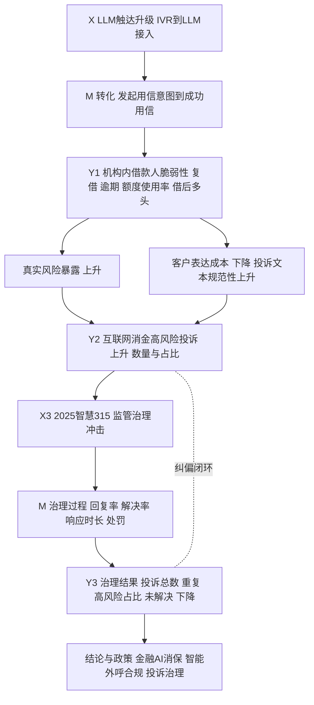
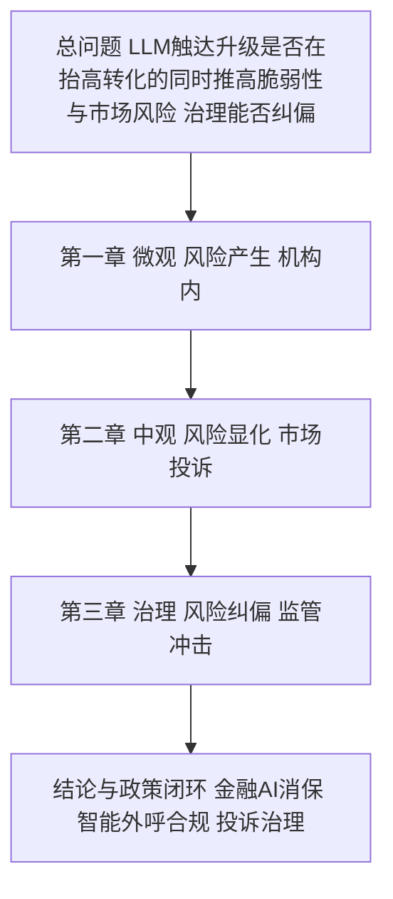
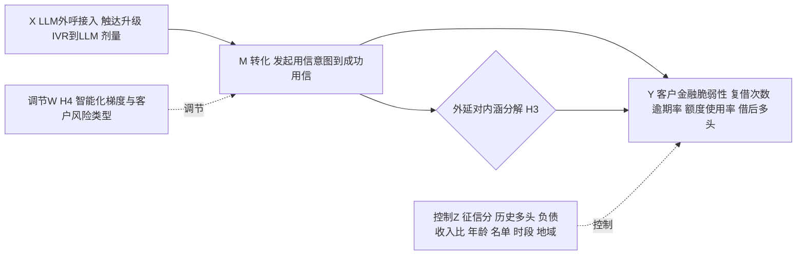
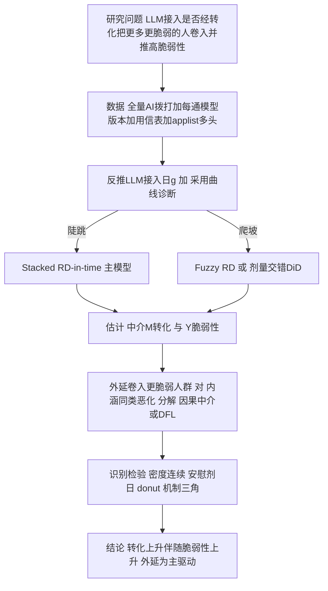
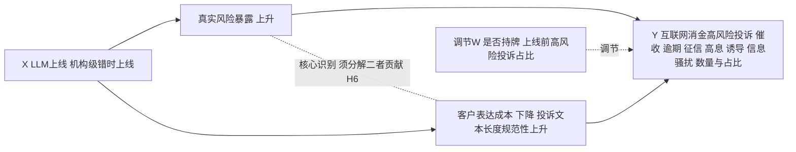
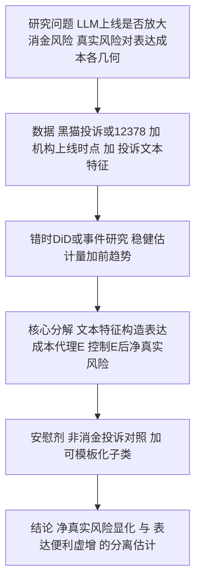
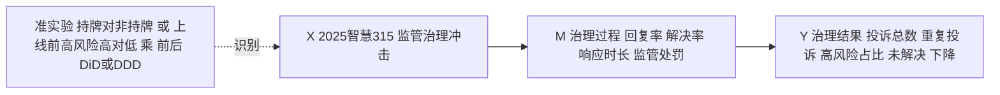
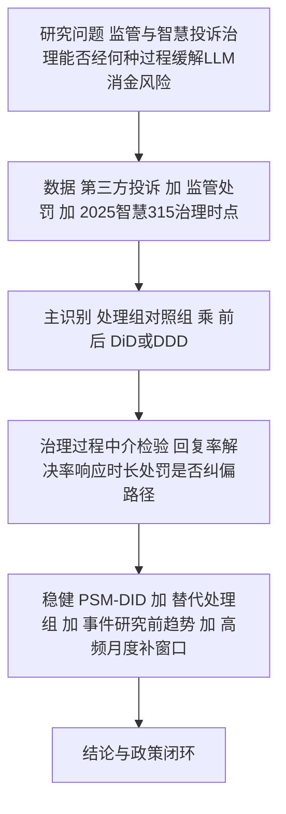

# 博士学位论文开题报告（正文初稿）

## 题目：LLM 大模型接入与互联网消费金融风险——从机构内"风险产生"到市场"风险显化"再到"治理纠偏"的三层因果识别

> 说明：本稿为可直接修改的开题报告正文。文中作者—年份引用均标注"[待核实]"，
> 须在文献检索恢复后逐条核实补全（检索式见文末附录）。识别局限已主动写入
> 第八部分，体现识别成熟度。

---

## 一、选题背景与研究意义

### （一）研究背景

近年来，持牌消费金融机构的客户触达方式经历了由人工到智能的快速演进。早期电销
外呼以人工拨打为主，包含预览式（坐席手动拨打）、巡航式（选定名单后自动依次拨
通转坐席）与预测式（系统自动拨通后转接坐席）三种模式；随后机构陆续引入 AI 坐
席，其智能化程度从普通 IVR 逐步升级至基于大语言模型（LLM）的对话式智能体。在
典型业务流程中，大模型先行外呼并筛选出"有意向"客户，再将其转接人工坐席完成
成交，由此形成"AI 筛选与劝说—人工成交"的信贷获客漏斗。

与传统自动化（机械化、流程化替代）不同，对话式 AI 直接作用于识别意向、个性化
劝说等认知与沟通任务。它不仅改变获客效率，更可能改变**哪些人被放进借贷漏斗**
以及**进入后被劝说的强度**，进而影响借款人是否陷入重复借贷、多头借贷与过度负
债。这一机制在已有研究中尚未被系统识别，却具有重要的学术与政策含义。

### （二）研究意义

理论意义：现有"AI 与信贷"文献多聚焦算法定价、可得性与公平性，"AI 与劳动"
文献多聚焦岗位替代；二者均未系统进入"对话式 AI 作为获客漏斗顶端的触达升级，
如何在机构内推高借款人金融脆弱性、在市场上以投诉显化、并能否被治理纠偏"这一
**"风险产生—显化—治理"闭环**。本文以同一风险构念贯通机构内部微观、市场投诉
与监管治理三层因果证据，是对算法信贷、行为家庭金融与监管经济学交叉领域的推进。

现实与政策意义：共债、诱导借贷、暴力催收与个人信息骚扰是当前互联网消费金融
监管的核心关切。本文量化 LLM 触达升级对借款人脆弱性与市场投诉风险的因果影响，
并评估 2025 智慧 315／监管治理冲击的纠偏效果，可为金融 AI 消费者保护、智能外呼
合规与投诉治理提供直接经验证据。

---

## 二、国内外研究现状与文献述评

### （一）算法/人工智能与消费信贷

该线研究表明机器学习改变了信贷的定价、可得性与分配公平性（Fuster, Goldsmith-
Pinkham, Ramadorai & Walther, 2022[待核实]；Berg, Burg, Gombović & Puri,
2020[待核实]；Bartlett, Morse, Stanton & Wallace, 2022[待核实]；Di Maggio &
Yao, 2021[待核实]）。其关注点集中于"算法如何评估与给谁放贷"，对"算法如何在
获客端筛选并劝说客户进入借贷"着墨较少。

### （二）过度负债、重复借贷与家庭金融脆弱性

行为家庭金融与消费信贷文献记录了高息小额信贷、重复借贷对借款人福利的负面影响
（Melzer, 2011[待核实]；Gathergood, Guttman-Kenney & Hunt, 2019[待核实]）。
国内关于现金贷、网络小贷与居民过度负债亦有积累，但以宏观或调查数据为主，缺乏
来自持牌机构、可识别获客技术冲击的微观因果证据。

### （三）劝说经济学与对话式人工智能

劝说经济学刻画了信息与说服对决策的因果作用（DellaVigna & Gentzkow,
劝说综述[待核实]）；智能投顾文献揭示算法建议的双刃性（D'Acunto, Prabhala &
Rossi, 2019[待核实]）；生成式 AI 在客服等场景显著提升生产率（Brynjolfsson,
Li & Raymond 线[待核实]）。但"对话式 AI 的说服力如何作用于借贷决策、并改变
进入信贷的人群组成"尚属空白。

### （四）文献述评与研究空白

综合可见：已有研究回答的是"算法如何定价/给谁放贷"与"过度负债的后果"；尚未
系统回答"漏斗顶端的 LLM 触达升级是否在机构内推高借款人脆弱性、在市场层面以
投诉放大可观测风险、且这一投诉上升中**真实风险暴露**与**客户表达成本下降**各
占多少，监管与智慧投诉治理又能否纠偏"。本文拟填补这一"风险产生—显化—治理"
的系统性空白，其可行性建立在一项稀缺机构数据资产（持牌消金全量 AI 拨打记录＋
用信表＋applist 多头）与两类可识别的外生冲击（机构级 LLM 上线、2025 智慧 315
治理）之上。（注：上述空白判断为基于知识的初判，最终须经系统文献检索核实，
检索式见附录。）

---

## 三、研究问题与研究内容

总问题：**LLM 大模型接入消费信贷触达，是否在抬高获客转化的同时推高借款人金融
脆弱性与市场可观测风险；监管与智慧投诉治理又能在多大程度上将其纠偏？**

三章对应三个平行、共享同一风险构念的子问题，构成"产生—显化—治理"链：

1. （第一章·微观·风险产生）机构内部，LLM 外呼接入是否通过提高用信转化（意图
   →成功用信），把更多、更脆弱的人卷入借贷，并推高其复借、逾期、额度使用率与
   借后多头（下载其他借贷 App）？本章**不以"提高转化率"为落脚点，转化仅作中介
   变量**。
2. （第二章·中观·风险显化）在市场层面，LLM 上线是否放大了互联网消费金融可观测
   风险（催收、逾期、征信、高息/隐形收费、诱导借款、个人信息骚扰类投诉的数量
   与占比）？且需识别投诉上升中**"真实风险暴露↑"**与**"客户表达成本↓"**（LLM
   同时降低了投诉撰写门槛）各自的贡献——此为本章核心识别任务。
3. （第三章·治理·风险纠偏）2025 智慧 315／监管治理冲击能否、并经由何种治理过程
   （投诉回复率、解决率、平均响应时长、是否伴随监管处罚）缓解 LLM 带来的消金
   风险（投诉总量、重复投诉、高风险投诉占比、未解决投诉的下降）？

三章串联装置：同一"互联网消费金融风险/借款人脆弱性"构念被三套数据各测一次；
驱动在一、二章为"LLM 触达升级"，在第三章切换为其反向的"治理冲击"，作用于同一
被解释构念，形成"产生→显化→纠偏"闭环。

---

## 四、核心命题、理论机制与研究假设

本文核心机制章为第一章，使用持牌消金客户级微观数据，直接回答"LLM 触达升级
如何影响借款人借贷行为与脆弱性"。落脚点是**借款人金融脆弱性**，而非放贷方
转化效率（转化仅作中介变量）。三章命题如下，构成"产生—显化—纠偏"闭环。

第一章（风险产生）：
- H1 卷入扩张（外延边际）：LLM 接入后更多人接触消费金融并发起/成功用信
  （转化↑），其中边际客户风险更高。
- H2 脆弱性↑：入群客户复借次数、逾期率（DPD30+）、额度使用率、借后多头
  （下载其他借贷 App）上升。
- H3 中介与分解（核心识别任务）：H1 的转化提升是 H2 的中介路径——"被更多
  卷入"（外延）相对"同类人借更多"（内涵）为主驱动。
- H4 智能化梯度（调节）：在 IVR→LLM 阶梯上 LLM 档边际效应最强，按客户风险
  类型异质。

第二章（风险显化）：
- H5 风险显化：LLM 上线后，互联网消金高风险类投诉（催收/逾期/征信/高息/诱导
  /信息骚扰）数量及其占全部投诉比例上升。
- H6 测量分解（本章核心识别）：投诉上升 ＝ 真实风险暴露↑ ＋ 客户表达成本↓
  （LLM 降低投诉撰写门槛，文本长度/规范性/要素完备度上升）；须估计两部分各自
  贡献，剥离"会写投诉"造成的虚增。
- H7 异质（调节）：是否持牌、上线前机构高风险投诉占比不同，显化幅度不同。

第三章（风险纠偏）：
- H8 治理纠偏：2025 智慧 315／监管治理冲击后，投诉总数、重复投诉、高风险投诉
  占比、未解决投诉下降。
- H9 治理机制：纠偏经由治理过程（回复率↑、解决率↑、响应时长↓、监管处罚）
  实现，而非投诉自然回落。

机制总链：LLM 触达升级 →（转化↑、卷入更脆弱人群）→ 机构内脆弱性↑（第一章）
→ 市场投诉显化（含真实风险与表达成本两分，第二章）→ 治理冲击经治理过程纠偏
（第三章）。

---

## 五、研究设计与计量模型

### （一）第一章（微观·风险产生）

数据与样本：持牌消金全量 AI 拨打记录＋每通模型版本＋用信表＋applist 多头。以
全量被拨打客户为总体，按首次进入漏斗时间 entrydate_i 构造入群队列；LLM 接入日
g 由"LLM 版本最早出现的拨打时间"反推，并作采用曲线诊断（陡跳 vs 灰度爬坡）。

主模型——Stacked RD-in-time，驱动变量 r_i = entrydate_i − g，带宽 b 内局部线性：

  Y_i = α + τ·Post_i + ρ₁·r_i + ρ₂·(Post_i·r_i) + X_i′γ + ε_i ， |r_i| ≤ b

τ 识别"被升级后模型筛选与劝说"对入群队列的因果效应；b 取 Calonico-Cattaneo-
Titiunik 数据驱动带宽，标准误按入群日聚类；多升级日堆叠并加事件×名单来源固定
效应，估计异质 τ_g 检验 H4。灰度情形改用 Fuzzy RD-in-time，或剂量型交错 DiD
（Callaway & Sant'Anna 2021[待核实]／de Chaisemartin & D'Haultfœuille
2020[待核实]，规避负权重），以事件研究图检验前趋势。

变量：处理＝Post_g（或入群时模型档 IVR/LLM-v1/LLM-v2，剂量）。**中介 M**＝是否
发起用信申请（意图）、是否成功用信（转化）。**因变量 Y＝客户金融脆弱性**：入群
后 90/180 天复借次数与金额、逾期率（DPD30+）、额度使用率、借后是否下载其他借贷
App（applist 多头）及脆弱性综合指数。转化仅作中介，**不作落脚结果**（规避"智能
触达提高转化率"的放贷方效率叙事）。控制 Z＝征信分、历史多头、负债收入比、年龄、
名单来源、活动类型、时段、地域。

中介与外延分解（H3）：以因果中介分析估计"经转化卷入"的间接效应，并以 DiNardo-
Fortin-Lemieux 重加权 / Oaxaca-Blinder 将升级对脆弱性的总效应拆为"经转化卷入
更多/更脆弱人群"（外延）与"同类客户行为恶化"（内涵），判定外延为主驱动。

识别检验：入群时点密度连续性（McCrary／Cattaneo-Jansson-Ma）、非升级日安慰剂
（τ≈0）、donut-RD、带宽敏感、协变量连续性、控制宏观信贷周期与监管事件、LLM
话术文本—说服强度—结果机制三角。

### （二）第二章（中观·风险显化）

数据：以公开投诉为主——黑猫投诉等第三方平台、12378 银保监投诉转办、（备选）
中国裁判文书网金融借款/民间借贷纠纷，按机构×月（或地区×月）构面板，结合第一章
机构 LLM 上线时点 g_j。

被解释变量 Y：高风险类投诉数量（催收、逾期、征信、高息/隐形收费、诱导借款、
个人信息骚扰）与互联网消费金融投诉数/全部投诉数量之比；上线前机构高风险投诉
占比作基期。

主识别——LLM 上线错时事件研究/DiD（机构级错时上线）：

  Complaint_{j,t} = Σ_k δ_k·1{t−g_j = k} + θ·Z_{j,t} + μ_j + λ_t + ε_{j,t}

以稳健交错 DiD 估计量规避负权重，事件研究图检验前趋势。

核心识别——真实风险 vs 表达成本分解（H6）：ΔC ＝ Δ真实风险 ＋ Δ表达成本。以
投诉文本特征（文本长度、结构规范性、要素完备度、是否疑似 AI 辅助撰写）构造
表达成本代理 E_{j,t}：

  C_{j,t} = π·Post_{j,t} + φ·E_{j,t} + ψ·(Post×E) + μ_j + λ_t + u_{j,t}

控制 E 后的 π 解释为"净真实风险显化"，E 路径解释为"表达便利虚增"。以非消费
金融投诉作对照（表达成本应同步、真实风险不应同步上升）、以可模板化/格式化投诉
子类作表达成本敏感安慰剂。调节 W＝是否持牌、上线前高风险投诉占比。

### （三）第三章（治理·风险纠偏）

数据：第三方投诉＋监管处罚公开信息，构造机构（或平台）×月治理面板，覆盖 2025
智慧 315／监管治理冲击前后。注：该冲击较新（截至 2026 年初事后期约一年），以
高频月度数据与事件研究弥补窗口。

被解释变量 Y：投诉总数、重复投诉率、高风险投诉占比、未解决投诉数。处理＝治理
冲击 Post_t；处理组 vs 对照组取"持牌 vs 非持牌"或"上线前高风险占比 高 vs 低"。
主识别 DiD/三重差分：

  Y_{j,t} = β·(Treat_j × Post_t) + μ_j + λ_t + Z_{j,t}′γ + ε_{j,t}

机制（H9）：治理过程变量——投诉回复率、解决率、平均响应时长、是否伴随监管
处罚——作中介，检验纠偏是否经治理过程而非投诉自然回落（以无治理过程改善的
对照组作安慰剂）。事件研究检验前趋势，PSM-DID 与替代处理组定义作稳健。

三章逻辑闭环：第一章（机构内风险产生）→ 第二章（市场投诉显化，真实/表达两分）
→ 第三章（治理冲击纠偏），同一风险构念、同一驱动族（LLM 触达升级及其治理反向
冲击）贯通。

---

## 六、数据来源与可行性分析

| 章 | 数据 | 可得性 | 落地判定 |
|---|---|---|---|
| 一 风险产生 | 持牌消金全量 AI 拨打＋每通模型版本＋用信表＋applist 多头 | 已锁定 | 可落地；剩余动作为采用曲线自诊 |
| 二 风险显化 | 黑猫投诉/12378（备选裁判文书）＋机构 LLM 上线时点＋投诉文本 | 公开可爬取 | 可落地；表达成本代理构造为关键设计点 |
| 三 风险纠偏 | 第三方投诉＋监管处罚＋2025 智慧 315 治理时点 | 公开可得 | 可落地；数据窗口偏薄，以高频月度与事件研究弥补 |

第一章硬前提（每通电话↔模型版本、LLM 上线日）已由机构数据满足；第二、三章
使用公开投诉与监管信息，方法成熟。主要剩余设计点为第二章"真实风险 vs 表达
成本"分解与第三章处理组定义。

---

## 七、可能的创新点

1. 问题创新：构建并检验"风险产生（机构内）—风险显化（市场投诉）—风险纠偏
   （治理冲击）"完整闭环，跳出"智能触达提高转化率"的放贷方效率叙事。
2. 识别创新：提出并实现投诉上升的**"真实风险暴露 vs 客户表达成本下降"**分解
   （以投诉文本特征作表达成本代理），解决"LLM 也让人更会投诉"这一长期混淆。
3. 数据创新：持牌消金全量 AI 拨打＋用信＋applist，叠加公开投诉与监管治理准实验，
   三源数据对同一风险构念三重测量、互证。
4. 政策创新：直接评估 2025 智慧 315／监管治理的纠偏效果，为金融 AI 消费者保护
   与投诉治理提供可操作证据。

---

## 八、研究局限与应对

若 LLM 为全量同时切换，RD-in-time 难完全剥离同期共同冲击，以安慰剂日、donut-RD、
宏观/监管控制与机制三角缓释，灰度情形以 Fuzzy RD 或剂量型交错 DiD 互证。第二章
投诉数据存在自选择（并非所有受损者投诉）且"表达成本代理"含测量误差，以多代理、
非消金对照与可模板化子类安慰剂缓释，结论就"可观测风险"而非全部福利损失作陈述。
第三章 2025 治理冲击数据窗口偏薄、处理组定义存争议，以高频月度、事件研究、替代
处理组与 PSM-DID 互证。结果外推至其他机构需谨慎。上述局限按国内核心与毕业导向
标准属可接受范围，并将在论文中明确陈述。

---

## 九、章节结构与研究进度

章节：第一章 LLM 外呼接入与借款人金融脆弱性（微观·风险产生）；第二章 LLM
上线与互联网消费金融风险显化——真实风险与表达成本之辨（中观·风险显化）；第三章
监管与智慧投诉治理能否缓解 LLM 带来的消金风险（治理·风险纠偏）；另设导论、文献
综述、结论与政策建议。

进度（开题阶段交付）：完成三章研究设计与可行性论证，并提供少量描述性证据
（入群队列与采用曲线可构造性、机构 LLM 上线前后投诉量与文本特征的描述性变化、
2025 治理冲击前后投诉结构差异）。后续按产生—显化—纠偏顺序推进实证。

---

## 十、参考文献（待核实，须经检索补全）

Fuster, Goldsmith-Pinkham, Ramadorai & Walther (2022, JF)；Berg, Burg,
Gombović & Puri (2020, RFS)；Bartlett, Morse, Stanton & Wallace (2022,
JFE)；Di Maggio & Yao (2021, RFS)；Melzer (2011, QJE)；Gathergood,
Guttman-Kenney & Hunt (2019, RFS)；D'Acunto, Prabhala & Rossi (2019,
RFS)；DellaVigna & Gentzkow（劝说综述）；Brynjolfsson, Li & Raymond
（生成式 AI 客服）；Callaway & Sant'Anna (2021)；de Chaisemartin &
D'Haultfœuille (2020)；Calonico, Cattaneo & Titiunik（RD 带宽）；
Hausman & Rapson（RD-in-time）；Goldsmith-Pinkham, Sorkin & Swift /
Borusyak, Hull & Jaravel（移动份额 IV）；以及国内共债、过度负债、数字普惠
金融、消费金融监管相关核心期刊文献。

---

## 十一、技术路线图与研究框架（产生—显化—纠偏）

> 已据此生成 7 页 PPT（`技术路线图_LLM消费信贷.pptx`，由 `make_ppt.py` 原生
> 形状生成，可直接编辑）。以下 Mermaid 源码与 PPT 一一对应，可另行渲染。
> 总框架为"产生→显化→纠偏"闭环；每章含"框架图（X→中介M→Y，含调节W/控制Z）"
> 与"技术路线图（问题→数据→识别→检验→结论）"。

### 11.A 总框架·三章串联（产生—显化—纠偏，首图）

读法：第一章在机构内"产生"脆弱性（X→M转化→Y1）；第二章在市场上"显化"为
投诉，并分解为真实风险与表达成本两条路径汇入 Y2；第三章以治理冲击"纠偏"
（X3→M治理过程→Y3），回拉 Y2 形成闭环。同一风险构念，三套数据三测互证。

### 11.B 七页 PPT 结构（已生成）

1. 总框架·三章串联（产生—显化—纠偏闭环，含总问题与 Q1–Q3）
2. 第一章 框架图：X LLM外呼接入｜M 转化（意图/成功用信）｜Y 客户金融脆弱性｜
   W 智能化梯度·风险类型｜Z 控制；标注外延边际与 H1–H4
3. 第一章 技术路线图：问题→数据→g与采用曲线→陡跳RD/爬坡FuzzyRD→估计M与Y→
   外延vs内涵分解→识别检验→结论
4. 第二章 框架图：X LLM上线｜双中介 真实风险暴露↑ / 客户表达成本↓（核心识别
   命门 H6）｜Y 高风险投诉数量与占比｜W 是否持牌·上线前高风险占比；标注 H5–H7
5. 第二章 技术路线图：问题→数据（黑猫/12378+上线时点+投诉文本）→错时DiD/事件
   研究→真实vs表达分解（文本代理）→非消金对照安慰剂→结论
6. 第三章 框架图：准实验（持牌vs非持牌×前后 DiD/DDD）｜X 2025智慧315治理冲击｜
   M 治理过程｜Y 治理结果↓；标注 H8–H9
7. 第三章 技术路线图：问题→数据→DiD/DDD主识别→治理过程中介检验→PSM-DID与
   替代处理组稳健→结论与政策闭环

每页底部图例按颜色区分变量角色：自变量X（深蓝）/中介M（青）/调节W（紫）/控制Z
（灰）/识别IV或冲击（琥珀）/因变量Y（绿·红·橙）。改数值后重跑 `make_ppt.py`
即可重生成。

### 11.0 总体研究逻辑链

### 11.1 第一章 框架图（X→中介M→Y，调节W·控制Z）

### 11.2 第一章 技术路线图

### 11.3 第二章 框架图（X→双中介→Y，核心识别 H6）

### 11.4 第二章 技术路线图

### 11.5 第三章 框架图（准实验·X→治理过程M→Y）

### 11.6 第三章 技术路线图

阅读提示：框架图回答"自变量经由什么中介作用于因变量、谁在调节、控制了什么"；
技术路线图回答"从研究问题到结论，数据—识别—检验如何串联"。三章被解释构念
同族（互联网消金风险/借款人脆弱性），驱动同族（LLM 触达升级及其治理反向冲击），
与 11.0 总链一致：产生→显化→纠偏闭环。

---

## 附录 A：白地排雷检索计划（文献检索恢复后执行）

英文：「conversational AI / large language model」+「consumer lending /
over-indebtedness / repeat borrowing」；「AI persuasion + credit demand」；
「telemarketing + consumer credit + default」；「robo/chatbot + loan
take-up + household finance」；「screening + extensive margin + fintech
credit」。
中文：智能外呼/对话式AI/大模型 + 营销 + 重复借贷/多头借贷/过度负债；消费金融
+ 电销 + 共债 + 金融脆弱性；数字普惠金融 + 家庭过度负债 + 裁判文书。

## 附录 B：方向一（备胎）

GenAI「核心任务替代」三章设计（PPT 已成型），仅在方向二不可行时启用。卖点
必须为公司内 core-substitution vs supplemental-complementarity 再配置机制
（可证伪命题），不得以"中文 LLM 暴露测量"为卖点。启用前须就 JF forthcoming
core/supplemental task 论文与 Acemoglu, Autor, Hazell & Restrepo (2022,
JOLE) 做撞车排雷与差异化。
