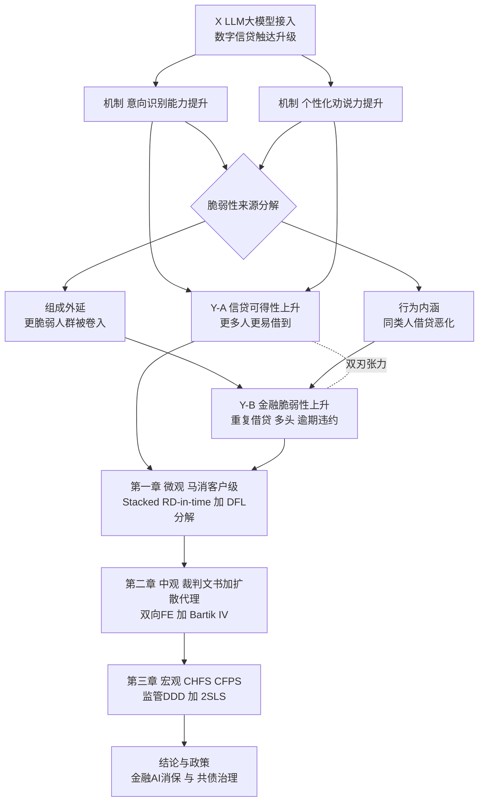
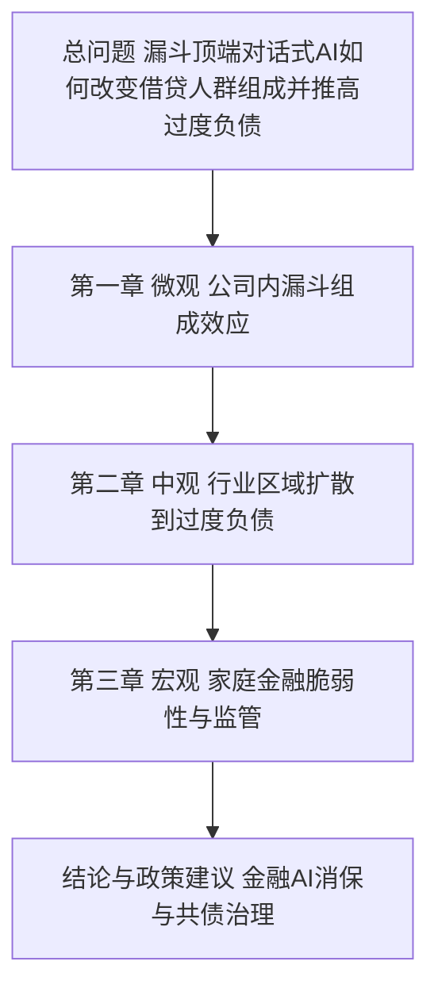
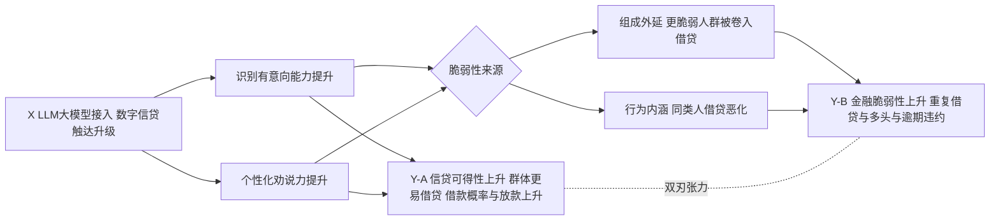
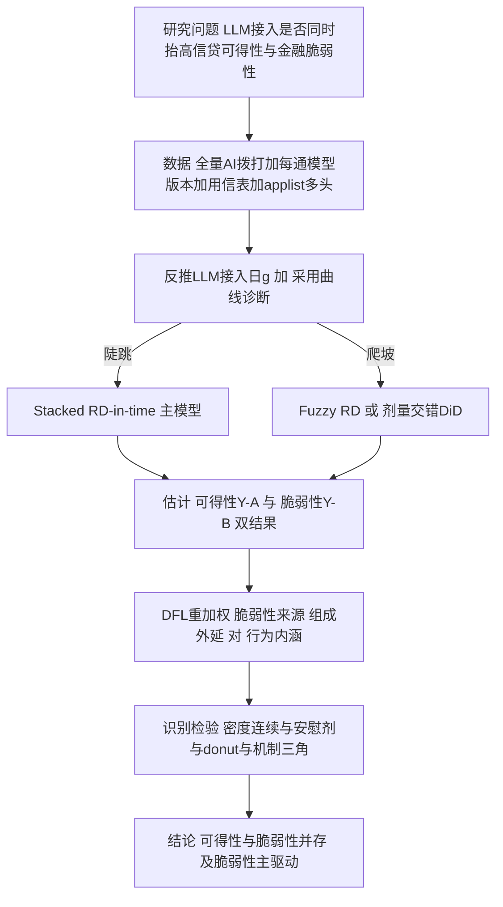
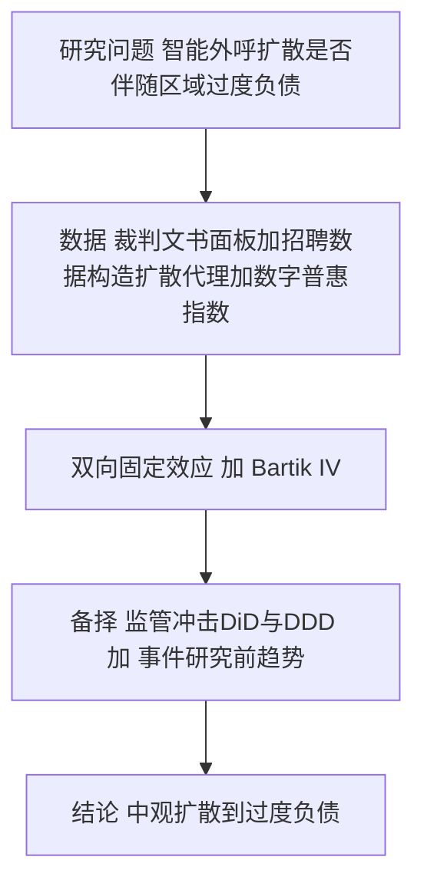
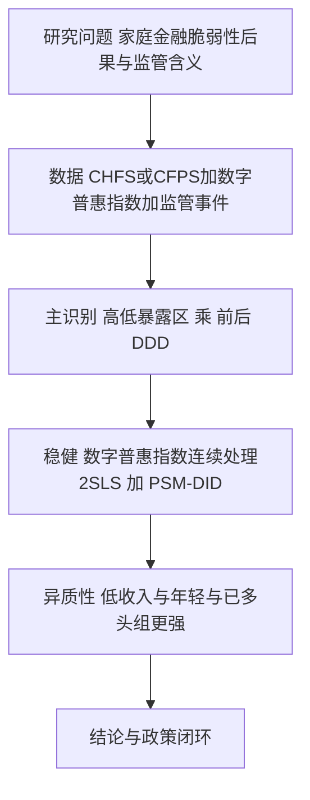

# 博士学位论文开题报告（正文初稿）

## 题目：对话式人工智能作为消费信贷漏斗顶端的筛选与劝说器——组成效应与家庭过度负债

> 说明：本稿为可直接修改的开题报告正文。文中作者—年份引用均标注"[待核实]"，
> 须在文献检索恢复后逐条核实补全（检索式见文末附录）。识别局限已主动写入
> 第八部分，体现识别成熟度。

---

## 一、选题背景与研究意义

### （一）研究背景

近年来，持牌消费金融机构的客户触达方式经历了由人工到智能的快速演进。早期电销
外呼以人工拨打为主，包含预览式（坐席手动拨打）、巡航式（选定名单后自动依次拨
通转坐席）与预测式（系统自动拨通后转接坐席）三种模式；随后机构陆续引入 AI 坐
席，其智能化程度从普通 IVR 逐步升级至基于大语言模型（LLM）的对话式智能体。在
典型业务流程中，大模型先行外呼并筛选出"有意向"客户，再将其转接人工坐席完成
成交，由此形成"AI 筛选与劝说—人工成交"的信贷获客漏斗。

与传统自动化（机械化、流程化替代）不同，对话式 AI 直接作用于识别意向、个性化
劝说等认知与沟通任务。它不仅改变获客效率，更可能改变**哪些人被放进借贷漏斗**
以及**进入后被劝说的强度**，进而影响借款人是否陷入重复借贷、多头借贷与过度负
债。这一机制在已有研究中尚未被系统识别，却具有重要的学术与政策含义。

### （二）研究意义

理论意义：现有"AI 与信贷"文献多聚焦算法定价、信贷可得性与公平性，"AI 与劳动"
文献多聚焦岗位替代，二者均较少进入"AI 作为获客漏斗顶端的筛选与劝说器，如何通
过改变借款人群体组成而非仅改变个体行为来影响金融脆弱性"这一层次。本文提出并
检验"组成效应"（composition effect），是对算法信贷与行为家庭金融交叉领域的
推进。

现实与政策意义：共债、多头借贷与居民部门过度负债是当前消费金融监管的核心关切。
本文基于持牌消金机构微观数据，量化对话式 AI 能力提升对借款人过度负债的因果影
响，可为金融领域 AI 应用的消费者保护、智能外呼合规与共债治理提供直接经验证据。

---

## 二、国内外研究现状与文献述评

### （一）算法/人工智能与消费信贷

该线研究表明机器学习改变了信贷的定价、可得性与分配公平性（Fuster, Goldsmith-
Pinkham, Ramadorai & Walther, 2022[待核实]；Berg, Burg, Gombović & Puri,
2020[待核实]；Bartlett, Morse, Stanton & Wallace, 2022[待核实]；Di Maggio &
Yao, 2021[待核实]）。其关注点集中于"算法如何评估与给谁放贷"，对"算法如何在
获客端筛选并劝说客户进入借贷"着墨较少。

### （二）过度负债、重复借贷与家庭金融脆弱性

行为家庭金融与消费信贷文献记录了高息小额信贷、重复借贷对借款人福利的负面影响
（Melzer, 2011[待核实]；Gathergood, Guttman-Kenney & Hunt, 2019[待核实]）。
国内关于现金贷、网络小贷与居民过度负债亦有积累，但以宏观或调查数据为主，缺乏
来自持牌机构、可识别获客技术冲击的微观因果证据。

### （三）劝说经济学与对话式人工智能

劝说经济学刻画了信息与说服对决策的因果作用（DellaVigna & Gentzkow,
劝说综述[待核实]）；智能投顾文献揭示算法建议的双刃性（D'Acunto, Prabhala &
Rossi, 2019[待核实]）；生成式 AI 在客服等场景显著提升生产率（Brynjolfsson,
Li & Raymond 线[待核实]）。但"对话式 AI 的说服力如何作用于借贷决策、并改变
进入信贷的人群组成"尚属空白。

### （四）文献述评与研究空白

综合可见：已有研究回答的是"算法如何定价/给谁放贷"与"过度负债的后果"；尚未
系统回答"漏斗顶端的对话式 AI 是否通过**改变准入人群组成**与**强化劝说**，把
更脆弱的边际客户转化为重复借贷者"。本文拟填补这一空白，其可行性建立在一项稀缺
数据资产（持牌消金全量 AI 拨打记录＋用信表＋applist 多头）与一类可识别的技术
迭代冲击之上。（注：上述空白判断为基于知识的初判，最终须经系统文献检索核实，
检索式见附录。）

---

## 三、研究问题与研究内容

总问题：**电销漏斗顶端 LLM 大模型接入这一数字信贷触达升级，是否同时提高了信贷
可得性与家庭金融脆弱性，并通过重复借贷与逾期推高借款人过度负债？**

三章对应三个子问题：
1. （微观·核心机制章）LLM 大模型接入后，群体是否**同时**变得更易借贷（信贷
   可得性↑）与更易重复借贷、多头、逾期违约（金融脆弱性↑）？脆弱性上升中，
   "更脆弱人群被卷入借贷"（组成/外延边际）与"同类人借贷行为恶化"（劝说/内涵
   边际）各贡献几何？（本章不以"提高转化率/效率"为落脚点。）
2. （中观）智能外呼/数字营销在行业与区域层面的扩散，是否伴随区域过度负债上升？
3. （宏观）该机制在家庭层面的金融脆弱性后果及其监管含义为何？

---

## 四、核心命题、理论机制与研究假设

本章定位：本文核心机制章，使用马消客户级微观数据，直接回答"数字信贷触达
（LLM 大模型接入）如何影响消费者借贷行为"。落脚点是**信贷可得性与金融脆弱性
并存的双刃张力**，而非放贷方转化效率（转化/效率仅作一阶段或机制变量）。

核心命题（双刃）：LLM 大模型接入这一智能触达升级——
- H1 信贷可得性↑：群体借款概率、获批与放款规模上升（更多人、更易借到）。
- H2 金融脆弱性↑：重复借贷、applist 多头、逾期违约上升。
- H3 脆弱性上升的来源分解：组成/外延（更脆弱人群被卷入借贷）vs 行为/内涵
  （同风险类型客户借贷行为恶化），二者各贡献几何——本章核心识别任务。
- H4 智能化梯度：在 IVR→LLM 阶梯上，LLM 档相对 IVR 档的边际效应最强
  （识别+个性化劝说机制特征）。

机制链：LLM 接入 → 意向识别与个性化劝说能力↑ → 边际/脆弱人群被转化进入借贷
（可得性↑）且被劝追加借贷（行为恶化）→ 重复借贷、多头与逾期上升（脆弱性↑）。

---

## 五、研究设计与计量模型

### （一）第一章（微观·核心）

数据与样本：以全量被 AI 拨打客户为总体，按**首次进入漏斗时间** entrydate_i
构造"入群队列"。每通电话已记录所用模型版本，升级日 g 由"该版本最早出现的拨打
时间"反推获得。**主事件取 LLM 大模型接入日**（IVR→LLM 的能力跳变，对应核心命题
H1–H4）；其余版本迭代（LLM-v1→v2…）作能力梯度与稳健性，并支撑 H4 的剂量响应。

采用曲线诊断（前置必做）：在每个 g 邻域按天绘制"各模型版本占当天通话比例"，
据此判定 g 为陡跳（一两日内 0→近 100%）抑或灰度爬坡（数周），以确定后续采用
sharp 还是 fuzzy 设定。该诊断可由数据自行完成，非外部未知量。

主模型——Stacked RD-in-time。单事件、带宽 b 内局部线性：

  Y_i = α + τ·Post_i + ρ₁·r_i + ρ₂·(Post_i·r_i) + X_i′γ + ε_i ， |r_i|≤b

其中 r_i = entrydate_i − g 为驱动变量，Post_i = 1{r_i≥0}，τ 为入群队列在升级
日处的跳变，识别"被升级后模型筛选与劝说"的因果效应；X_i 为入群前客户画像；
带宽 b 采用 Calonico-Cattaneo-Titiunik 数据驱动选取；标准误按入群日聚类。多升
级日堆叠估计并加入事件×名单来源固定效应 δ_g，剔除窗口内含其他升级的污染样本，
并估计异质 τ_g 以检验 H4（LLM 档拐点最陡）。

灰度情形的替代设定：若采用曲线为爬坡，则（a）Fuzzy RD-in-time，以 Post_g 作
"该通是否新模型"的工具变量估计 LATE；或（b）剂量型交错 DiD，以新模型占比为
连续处理，采用 Callaway & Sant'Anna(2021)[待核实] 或 de Chaisemartin &
D'Haultfœuille(2020)[待核实] 估计量以规避负权重，并以事件研究图检验前趋势。

组成效应分解（本文核心论点的识别）：将升级对下游过度负债的总效应分解为外延
（组成）与内涵（劝说）两部分。基于入群前协变量 X 估计 post 队列相对 pre 队列
的倾向并构造重加权权重，按 DiNardo-Fortin-Lemieux 重加权：

  总效应 = [E(Y|post) − E(Y|post; 重加权至 pre 的 X 分布)]    （外延/组成）
         + [E(Y|post; 重加权) − E(Y|pre)]                     （内涵/劝说）

并以 Oaxaca-Blinder 线性分解作稳健对照，据此判定"组成更脆弱"是否为主驱动。

变量：处理为 Post_g（g=LLM 接入日）或入群时模型档（IVR/LLM-v1/LLM-v2…，剂量）。
结果分两族，对应双刃命题——
- **（A）信贷可得性**（H1）：是否借款/借款概率、是否获批、放款笔数与金额、
  授信与动支额度（"群体是否更易借贷"）。
- **（B）金融脆弱性**（H2）：入群后 90/180 天重复借贷次数与金额、applist 多头
  机构数、逾期 DPD30+/违约、脆弱性综合指数。
转人工率/转化率**仅作一阶段或机制变量，不作本章落脚结果**（明确避免写成"智能
触达提高转化率"的放贷方效率叙事）。控制为征信分、历史多头、负债收入比、年龄、
名单来源、活动类型、时段与地域。

识别威胁与检验：对入群时点操纵作 McCrary 与 Cattaneo-Jansson-Ma 密度连续性
检验；以非升级日作安慰剂（τ 应≈0）；donut-RD 剔除升级日±d；带宽敏感性；断点
两侧协变量连续性；控制宏观信贷周期与监管事件（2017 现金贷新规、2020 网络小贷
新规）；以 LLM 话术文本特征—说服强度—结果作机制三角验证。

### （二）第二章（中观·外部）

单元为城市（或省）×年面板。被解释变量 Distress_{r,t} 取中国裁判文书网金融借款
合同纠纷/民间借贷纠纷案件数（人口标准化）或涉案金额。解释变量 Diffusion_{r,t}
为智能外呼/对话式 AI 扩散度，首选复用招聘大数据构造"区域智能外呼/电销 AI 岗位
招聘强度"（与既有数据资产协同、贴合主题），备选为北大数字普惠金融指数信贷子项。
基准为双向固定效应：

  Distress_{r,t} = β·Diffusion_{r,t} + θ·Z_{r,t} + μ_r + λ_t + ε_{r,t}

控制 Z 含人均 GDP、人口、产业结构与传统金融密度。针对内生性采用移动份额
（Bartik）工具变量——全国分行业智能外呼采用增速与区域基期行业结构交互，并报告
Goldsmith-Pinkham-Sorkin-Swift / Borusyak-Hull-Jaravel[待核实] 有效性检验；
另以 2017/2020 监管为事件、区域基期线上信贷暴露为处理强度做 DiD/DDD 与事件研究
作备择识别。

### （三）第三章（宏观·外部）

数据为 CHFS 或 CFPS 住户面板，被解释变量 Fragility_{h,t} 取负债收入比、偿债比、
逾期、"无法应急筹款"脆弱指标与是否多头借贷。主识别以 2017/2020 监管为准实验，
高暴露区与低暴露区、前后做三重差分：

  Fragility_{h,r,t} = β·(HighExp_r × Post_t) + μ_r + λ_t + X_{h,t}′γ + ε

稳健性以数字普惠金融指数为连续处理、沿用文献工具变量（到杭州距离/历史银行网点
密度）作 2SLS，并报告平行趋势、PSM-DID、替代测度与异质性（低收入、年轻、已多头
组应更强）。

三章逻辑链：微观（公司内漏斗组成效应）→ 中观（行业/区域扩散与过度负债）→ 宏观
（家庭脆弱性与监管含义闭环），因变量族与驱动族贯通。

---

## 六、数据来源与可行性分析

| 章 | 数据 | 可得性 | 落地判定 |
|---|---|---|---|
| 一 | 马消全量 AI 拨打＋每通模型版本＋用信表＋applist 多头 | 已锁定，硬前提已解除 | 可落地；唯一剩余动作为采用曲线自诊 |
| 二 | 裁判文书面板＋扩散代理（复用招聘数据/数字普惠指数） | 公开可得 | 可落地；扩散代理构造为关键设计点 |
| 三 | CHFS/CFPS＋数字普惠指数＋监管事件 | 公开可得，文献成熟范式 | 可落地，风险最低 |

第一章硬前提（每通电话↔模型版本、升级日）已由数据本身满足；第二、三章使用
公开数据与成熟方法。全篇落地不存在未决的阻塞性约束。

---

## 七、可能的创新点

1. 问题创新：跳出"智能触达提高转化率"的放贷方效率叙事，提出并检验"LLM 接入
   同时抬高信贷可得性与金融脆弱性"的双刃命题，并以组成（外延）vs 行为（内涵）
   分解识别脆弱性来源。
2. 数据创新：持牌消金全量 AI 拨打＋用信表＋applist 多头，构成抗复刻的稀缺证据。
3. 识别创新：以模型迭代升级日为多事件的 Stacked RD-in-time，并以 DFL 重加权
   分解外延/内涵边际；设计对"迭代是否分批"稳健。
4. 政策创新：为金融 AI 消费者保护与共债治理提供可操作的微观证据。

---

## 八、研究局限与应对

若模型升级为全量同时切换，RD-in-time 难以完全剥离当期宏观/公司共同冲击；本文
以安慰剂升级日、donut-RD、宏观与监管事件控制、组成效应分解及机制三角予以缓释，
并在灰度情形下以 Fuzzy RD 或剂量型交错 DiD 互证。漏斗内"转人工"为 AI 内生选择，
故不直接比较"人工 vs 无人工"，因果识别一律建立在升级事件的外生时点之上。受
数据期与匹配口径限制，结果外推至其他机构需谨慎。上述局限按国内核心与毕业导向
标准属可接受范围，并将在论文中明确陈述。

---

## 九、章节结构与研究进度

章节：第一章 漏斗顶端 AI 筛选/劝说与借款人过度负债（微观）；第二章 智能外呼/
数字营销扩散与区域过度负债（中观）；第三章 数字金融、AI 信贷与家庭金融脆弱性
（宏观）；另设导论、文献综述、结论与政策建议。

进度（开题阶段交付）：完成研究设计与可行性论证，并提供少量描述性可行性证据
（入群队列样本可构造性、采用曲线形态、用信表与 applist 匹配可行性、升级日前后
描述性差异）。后续按微观—中观—宏观顺序推进实证。

---

## 十、参考文献（待核实，须经检索补全）

Fuster, Goldsmith-Pinkham, Ramadorai & Walther (2022, JF)；Berg, Burg,
Gombović & Puri (2020, RFS)；Bartlett, Morse, Stanton & Wallace (2022,
JFE)；Di Maggio & Yao (2021, RFS)；Melzer (2011, QJE)；Gathergood,
Guttman-Kenney & Hunt (2019, RFS)；D'Acunto, Prabhala & Rossi (2019,
RFS)；DellaVigna & Gentzkow（劝说综述）；Brynjolfsson, Li & Raymond
（生成式 AI 客服）；Callaway & Sant'Anna (2021)；de Chaisemartin &
D'Haultfœuille (2020)；Calonico, Cattaneo & Titiunik（RD 带宽）；
Hausman & Rapson（RD-in-time）；Goldsmith-Pinkham, Sorkin & Swift /
Borusyak, Hull & Jaravel（移动份额 IV）；以及国内共债、过度负债、数字普惠
金融、消费金融监管相关核心期刊文献。

---

## 十一、技术路线图与研究框架（X→机制→Y）

> 以下为 Mermaid 流程图源码，可在支持 Mermaid 的编辑器/在线渲染器直接出图，
> 亦可据此在 PPT/Visio 重绘。每章含"框架图（X→机制→Y）"与"技术路线图"。

### 11.A 总框架·模型技术路线图（X→机制→Y，整合·首图）



读法：X（LLM接入）→ 双机制（识别↑、劝说↑）→ 双刃 Y（可得性↑ ⟷ 脆弱性↑），
脆弱性再拆组成/行为；微观→中观→宏观三层在不同数据上识别同一 X→Y 链并收口政策。
此为开题首图；下列 11.0–11.6 为分解视图。

### 11.B 技术路线图 PPT 单页设计（可直接拼版）

**版式**：16:9，单页。顶部标题带 → 中部主体框图区 → 底部一句话结论带。

**标题**：技术路线图 — LLM 大模型接入对消费者借贷行为的影响

**主体框图（自上而下五层，每层若干圆角矩形，箭头向下/分叉）**：
- L0 冲击 X：`LLM大模型接入｜数字信贷触达升级`（一只大框，深色）
- L1 机制（两框并排，由 X 各引一箭头）：`意向识别能力↑`　`个性化劝说力↑`
- L2 结果 Y 双刃（两框并排，菱形"脆弱性来源"夹中间）：
  左 `Y-A 信贷可得性↑ 更多人更易借到`；
  中 ◇`脆弱性来源分解`；
  右 `Y-B 金融脆弱性↑ 重复借贷·多头·逾期`。
  机制两框分别连 Y-A 与 ◇；◇ 再分叉两小框 `组成·外延 更脆弱人群被卷入`、
  `行为·内涵 同类人借贷恶化`，二者汇入 Y-B。Y-A 与 Y-B 间画一条虚线，
  标注"双刃张力"。
- L3 三层识别链（横向三框，左→右箭头）：
  `第一章 微观·马消客户级 ｜ Stacked RD-in-time + DFL分解` →
  `第二章 中观·裁判文书+扩散代理 ｜ 双向FE + Bartik IV` →
  `第三章 宏观·CHFS/CFPS ｜ 监管DDD + 2SLS`。
  （Y-A、Y-B 各引一箭头汇入"第一章"框。）
- L4 收口：`结论与政策｜金融AI消费者保护 · 共债治理`

**箭头标签（可选，挂在对应箭头上）**：X→机制"技术冲击"；机制→Y"识别+劝说"；
Y→识别链"实证检验"；识别链内"微观→中观→宏观"。

**底部一句话结论带**：智能信贷触达让更多人借到钱，但是否也让更多人陷进去——
本文用三层数据识别同一条 X→Y 因果链。

**讲稿备注（演讲者注释，逐层一句）**：
1. 自变量是 LLM 大模型接入这一可识别的技术冲击，非泛泛"AI"。
2. 两条机制：模型更会找有意向的人、更会个性化劝说。
3. 落脚不在转化率，而在双刃——可得性与脆弱性是否同时上升。
4. 关键识别任务：脆弱性上升是"更脆弱的人被卷入"还是"同类人借得更糟"。
5. 同一条链在微观/中观/宏观三套数据各识别一遍，互证后收口政策。

**两种出图路径**：
- A（最快）：把 §11.A 的 ```mermaid 代码贴 mermaid.live → 导出 PNG/SVG →
  插入此页框图区，配上面的标题与结论带。
- B（原生可改）：按上面 L0–L4 用 PowerPoint SmartArt/形状直接画，文字照抄；
  无需任何渲染工具，便于答辩前临时改字。

### 11.0 总体研究逻辑链



### 11.1 第一章 框架图（X→机制→Y）



### 11.2 第一章 技术路线图



### 11.3 第二章 框架图（X→机制→Y）


### 11.4 第二章 技术路线图



### 11.5 第三章 框架图（X→机制→Y）


### 11.6 第三章 技术路线图



阅读提示：框架图回答"自变量经由什么机制作用于因变量"；技术路线图回答"从研究
问题到结论，数据—识别—检验如何串联"。三章框架图的 Y 同族（过度负债/脆弱性），
X 同族（消费信贷 AI/数字化），与 11.0 总链一致。

---

## 附录 A：白地排雷检索计划（文献检索恢复后执行）

英文：「conversational AI / large language model」+「consumer lending /
over-indebtedness / repeat borrowing」；「AI persuasion + credit demand」；
「telemarketing + consumer credit + default」；「robo/chatbot + loan
take-up + household finance」；「screening + extensive margin + fintech
credit」。
中文：智能外呼/对话式AI/大模型 + 营销 + 重复借贷/多头借贷/过度负债；消费金融
+ 电销 + 共债 + 金融脆弱性；数字普惠金融 + 家庭过度负债 + 裁判文书。

## 附录 B：方向一（备胎）

GenAI「核心任务替代」三章设计（PPT 已成型），仅在方向二不可行时启用。卖点
必须为公司内 core-substitution vs supplemental-complementarity 再配置机制
（可证伪命题），不得以"中文 LLM 暴露测量"为卖点。启用前须就 JF forthcoming
core/supplemental task 论文与 Acemoglu, Autor, Hazell & Restrepo (2022,
JOLE) 做撞车排雷与差异化。
